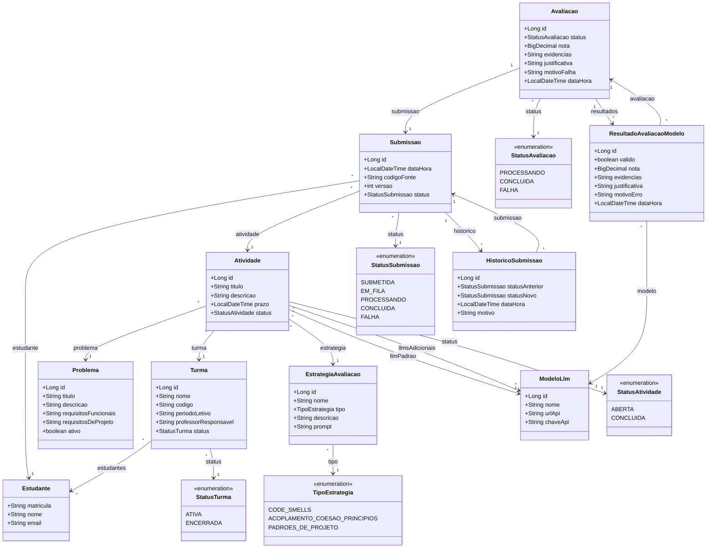

# UML atualizado — PSoft Arena

```mermaid
classDiagram
  class Problema {
    +Long id
    +String titulo
    +String descricao
    +String requisitosFuncionais
    +String requisitosDeProjeto
    +boolean ativo
  }
  class Turma {
    +Long id
    +String nome
    +String codigo
    +String periodoLetivo
    +String professorResponsavel
    +StatusTurma status
  }
  class Estudante {
    +String matricula
    +String nome
    +String email
  }
  class EstrategiaAvaliacao {
    +Long id
    +String nome
    +TipoEstrategia tipo
    +String descricao
    +String prompt
  }
  class TipoEstrategia {
    <<enumeration>>
    CODE_SMELLS
    ACOPLAMENTO_COESAO_PRINCIPIOS
    PADROES_DE_PROJETO
  }
  class StatusTurma {
    <<enumeration>>
    ATIVA
    ENCERRADA
  }
  class ModeloLlm {
    +Long id
    +String nome
    +String urlApi
    +String chaveApi
  }
  class Atividade {
    +Long id
    +String titulo
    +String descricao
    +LocalDateTime prazo
    +StatusAtividade status
  }
  class StatusAtividade {
    <<enumeration>>
    ABERTA
    CONCLUIDA
  }
  class Submissao {
    +Long id
    +LocalDateTime dataHora
    +String codigoFonte
    +int versao
    +StatusSubmissao status
  }
  class StatusSubmissao {
    <<enumeration>>
    SUBMETIDA
    EM_FILA
    PROCESSANDO
    CONCLUIDA
    FALHA
  }
  class HistoricoSubmissao {
    +Long id
    +StatusSubmissao statusAnterior
    +StatusSubmissao statusNovo
    +LocalDateTime dataHora
    +String motivo
  }
  class Avaliacao {
    +Long id
    +StatusAvaliacao status
    +BigDecimal nota
    +String evidencias
    +String justificativa
    +String motivoFalha
    +LocalDateTime dataHora
  }
  class StatusAvaliacao {
    <<enumeration>>
    PROCESSANDO
    CONCLUIDA
    FALHA
  }
  class ResultadoAvaliacaoModelo {
    +Long id
    +boolean valido
    +BigDecimal nota
    +String evidencias
    +String justificativa
    +String motivoErro
    +LocalDateTime dataHora
  }

  Turma "*" --> "*" Estudante : estudantes
  Atividade "*" --> "1" Problema : problema
  Atividade "*" --> "1" Turma : turma
  Atividade "*" --> "1" EstrategiaAvaliacao : estrategia
  Atividade "*" --> "1" ModeloLlm : llmPadrao
  Atividade "*" --> "*" ModeloLlm : llmsAdicionais
  EstrategiaAvaliacao "*" --> "1" TipoEstrategia : tipo
  Turma "*" --> "1" StatusTurma : status
  Atividade "*" --> "1" StatusAtividade : status
  Submissao "*" --> "1" Estudante : estudante
  Submissao "*" --> "1" Atividade : atividade
  Submissao "*" --> "1" StatusSubmissao : status
  HistoricoSubmissao "*" --> "1" Submissao : submissao
  Submissao "1" --> "*" HistoricoSubmissao : historico
  Avaliacao "1" --> "1" Submissao : submissao
  Avaliacao "*" --> "1" StatusAvaliacao : status
  ResultadoAvaliacaoModelo "*" --> "1" Avaliacao : avaliacao
  ResultadoAvaliacaoModelo "*" --> "1" ModeloLlm : modelo
  Avaliacao "1" --> "*" ResultadoAvaliacaoModelo : resultados
```
